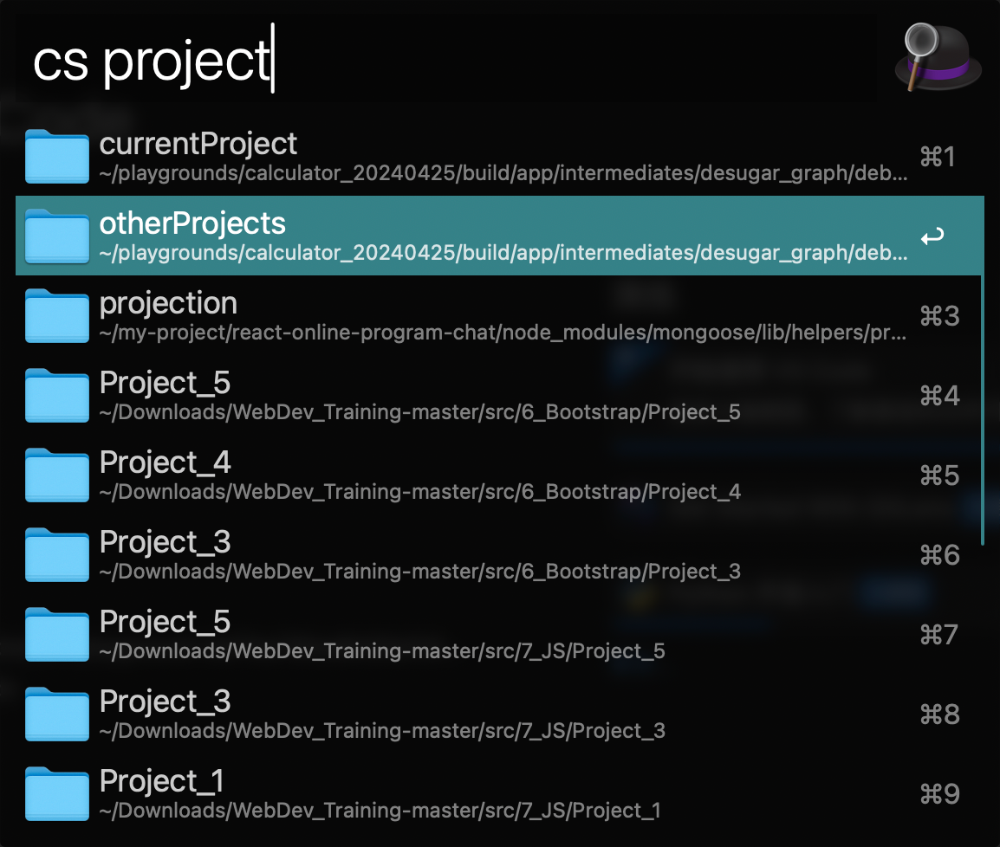

# alfred-open-with-cursor

Alfred workflow to open files with cursor position.

## Installation

Download the latest release of the workflow from the releases page.
Double-click the downloaded file to install it in Alfred.

## Requirements

- Alfred 4 or later with Powerpack
- Cursor installed on your Mac

